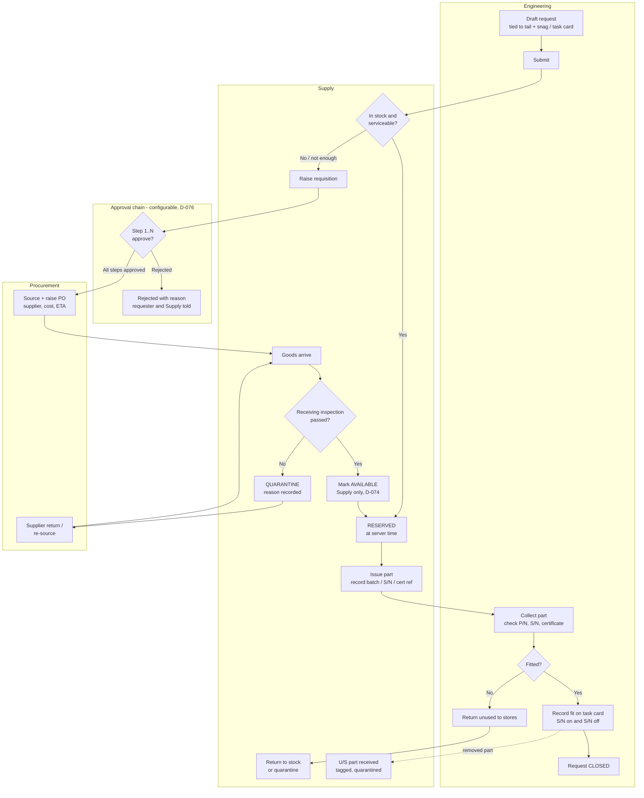

# Part Request Workflow (O-8)

**Status:** DRAFT for Promise's review. Nothing here is a decision until it is agreed and logged in `DECISIONS.md`.
**Builds on:** D-006, D-020, D-023, D-025, D-039, D-070 to D-077, D-103 to D-105
**Phase:** 3 (Supply and approvals). The links it needs (to tail, snag, task card) have to be designed in during Phases 1 and 2.

---

## 1. Summary

A part request is the engineer's demand for a part. It always belongs to one tail and one job. From there it goes one of two ways:

- **In stock:** Supply reserves the part, issues it, and the engineer fits it or returns it. This should take minutes.
- **Not in stock:** Supply raises a **requisition**. The requisition goes through the approval chain, then Procurement places the order, then Supply receives and inspects the part and stocks it. The part is then reserved for the original request and the engineer is told it is ready.

The design keeps **two linked records**:

| Record | Owned by | Answers |
|---|---|---|
| **Part Request (PR)** | Engineering | "What do I need, for which aircraft and job, and where is it?" |
| **Requisition (REQ) → Purchase Order (PO)** | Supply, then Procurement | "How are we getting it, who approved it, what did it cost?" |

**Why two records:** the engineer's need and the purchase are separate things. One purchase can cover several requests, a request can be met partly from stock and partly by purchase, and cost data has to stay behind stricter permissions (D-077). Keeping them apart lets the engineer follow progress without seeing prices.

---

## 2. Who is involved

| Actor | Department | Role in this workflow |
|---|---|---|
| Requesting engineer | Engineering | Raises the request, collects the part, records fit or return |
| Certifying engineer | Engineering | Confirms AOG priority (proposed, see Q-3) |
| Storekeeper | Supply | Checks stock, reserves, issues, raises requisition |
| Receiving inspector | Supply | Inspects incoming parts and certificates, accepts or quarantines |
| Approvers | Configurable (D-076) | Approve or reject the requisition, step by step |
| Buyer | Procurement | Sources, raises PO, tracks the supplier |
| Quality | Across | Owns the approved supplier list and the accepted certificate types (proposed, Q-6); audits |
| Operations | Across | Read-only: sees the effect on tail availability and the ETA |
| Command | Across | Final approval step where configured; sees cost |

---

## 3. The flow

---

## 4. Part Request states

Every state names the **department holding it**. This is what feeds the live "Blocked by" view (D-006): the tail shows the blocking request, who holds it, and for how long.

| # | State | Holder | What happens to leave this state | Works offline? |
|---|---|---|---|---|
| PR-1 | **Draft** | Engineering | Engineer submits | Yes |
| PR-2 | **Queued (offline)** | Engineering (device) | Device syncs. Shown as *"Queued, not reserved"* so nobody thinks the part is held | Yes |
| PR-3 | **Submitted** | Supply | Storekeeper checks stock: reserve, partly reserve, or raise requisition | n/a |
| PR-4 | **Reserved** | Supply | Storekeeper issues. Stock is held from this moment (D-071) | Online only |
| PR-5 | **On order** | Mirrors the requisition (approver, Procurement or Supply) | Part arrives, passes inspection, gets reserved, then PR-4 | n/a |
| PR-6 | **Issued** | Engineering | Engineer records fit or returns the part | Fit record can be offline (D-103 "updating tasks") |
| PR-7 | **Closed – Fitted** | — | End | — |
| PR-8 | **Closed – Returned unused** | — | End | — |
| PR-9 | **Cancelled** | — | End. Soft cancel with who, when, why (D-023). Releases any reservation | Online only |
| PR-10 | **Rejected** | Engineering | Requester revises (new version) or cancels | — |

**Partial quantities:** if 4 are needed and 2 are in stock, the request splits into **lines**. Line A (qty 2) goes to Reserved and line B (qty 2) goes to On order. The request stays open until every line is closed. The "Blocked by" view shows the slowest line.

---

## 5. Requisition and purchase states

| # | State | Holder | Leaves when |
|---|---|---|---|
| RQ-1 | **Raised** | Supply | Storekeeper submits it into the chain |
| RQ-2 | **In approval – step n of N** | The role at step n | Approved goes to the next step. Rejected goes to RQ-8 |
| RQ-3 | **Approved – sourcing** | Procurement | Buyer raises the PO |
| RQ-4 | **Ordered** (PO no., supplier, cost, ETA) | Procurement (supplier) | Supplier ships |
| RQ-5 | **In transit** | Procurement (carrier / customs) | Goods arrive at stores |
| RQ-6 | **Awaiting receiving inspection** | Supply | Inspector accepts or quarantines |
| RQ-7 | **Accepted – stocked** | — | Closes. The part is reserved for the linked request |
| RQ-8 | **Rejected in approval** | Supply / Engineering | Revised (new version, chain restarts) or cancelled |
| RQ-9 | **Quarantined at receipt** | Procurement | Supplier return or replacement, then back to RQ-4 |

**Customs (RQ-5):** for Nigerian operations, imported parts often sit in clearing longer than in the air. A separate *"In clearing"* sub-state may be worth having so the "Blocked by" view shows the real cause and not just "Procurement". This is Q-9 below.

---

## 6. What the engineer enters

| Field | Notes |
|---|---|
| Tail | Required |
| Linked job | **Required**: snag, non-routine card, task card or work order. No orphan requests (see risk R-1) |
| Part number | From the stores catalogue, or free text if not catalogued (Supply then catalogues it) |
| IPC / manual reference | Entered by the engineer. **The system does not decide interchangeability** (D-020). Alternate P/Ns are entered by the engineer, not suggested by the system |
| Quantity and unit | |
| Position | For tracked components (e.g. "No. 2 engine", "L/H MLG") |
| Priority | AOG / Urgent / Routine. Labels and response targets are configurable (D-025) |
| Required by | Date/time |
| Removed part disposition | Serviceable / Unserviceable / Not applicable. Starts the U/S return (Section 8) |
| Remarks, photos | PDF and images only (D-026) |

**What the engineer sees afterwards:** stock level, reservation, state, holder, ETA. **Not** cost, unless the operator's configuration allows it (D-077).

---

## 7. Rules the system enforces

| Rule | Source |
|---|---|
| Stock is reserved at **server time** on submission when available. Two requests for the last unit: the first to reach the server wins, the second is told and goes to On order | D-071, D-105 |
| The person who raises a requisition **cannot approve any step** of it, even if their role is in the chain | D-075, extended (Q-1) |
| The same person **cannot approve two steps** of the same requisition | Proposed (Q-1) |
| The buyer who raised the PO **cannot do the receiving inspection** for it | D-075 |
| **Only Supply** can mark a part available | D-074 |
| Approving, issuing, receiving and cancelling require **online** and PIN re-entry | D-094, D-104 |
| Expired or uncertified stock is flagged at search, reserve and issue | D-072. Block or warn is Q-4 |
| Any change to P/N, quantity or priority after approval creates a **new version** and restarts approval | D-023 |
| Nothing is deleted. Cancel, reject and return are states with who, when and why | D-023 |

**What the system never does:** decide whether a part is airworthy, interchangeable or fit for installation. It records what licensed people and the receiving inspector decided, and it shows warnings.

---

## 8. Loops people forget

1. **Unserviceable removed part.** When the engineer records "S/N off" on the task card, an expected **U/S return** is created at stores. Supply confirms receipt and tags it (U/S, quarantine, repair or scrap). Open U/S returns show on a report so rotables don't go missing in the hangar. Repair management itself (sending out, tracking repair orders) is **not v1**; flag as a later item.
2. **Issued but not fitted.** Issued parts with no fit and no return after X days (configurable) appear on Supply's outstanding-issues list, with a reminder to the engineer.
3. **Reserved but never collected.** Reminder after X hours. **Supply** releases the reservation manually, with a reason. The system does not auto-release (an AOG request could lose its part silently).
4. **Wrong part issued.** The engineer refuses at collection, giving a reason. The part goes back to stock and the request goes back to Reserved or On order.
5. **Requester cancels after the PO is placed.** The request closes. Procurement decides whether to cancel the PO or receive the part into stock. The PO is never silently orphaned.

---

## 9. Risks and abuse scenarios

| # | Risk | How it gets abused or fails | Mitigation |
|---|---|---|---|
| R-1 | Orphan requests | Parts drawn with no tail or job: pilferage, or no traceability for what was fitted | Linked job is mandatory. Supply-initiated stock top-ups use a separate **replenishment requisition**, not a part request |
| R-2 | Priority inflation | Everything marked AOG, so AOG means nothing | AOG only on a job that makes the tail unserviceable, or confirmed by a certifying engineer (Q-3). Report on priority use per person, visible to Quality and Command |
| R-3 | Split purchases | Large buy split into small requisitions to stay under an approval threshold | Flag same P/N, or same supplier, raised more than once within a configurable window |
| R-4 | Buyer–supplier collusion | Inflated prices, favoured supplier | Price history per P/N (D-077), outlier flag against the last price, buyer ≠ receiver (D-075) |
| R-5 | Suspected unapproved parts | Parts with fake or missing release certificates | Receiving inspection records certificate type and number. Approved supplier list owned by Quality (Q-6). A SUP report action that goes to Quality |
| R-6 | Ghost reservations | Engineer reserves "just in case" and blocks others | Reminders, Supply release (Section 8.3), report of reservations held longer than X |
| R-7 | Offline false confidence | Engineer offline thinks the part is held when it isn't | "Queued, not reserved" label. Reservation exists only once the server confirms |
| R-8 | Cannibalisation done off-system | Part robbed from another tail with no record, so the donor tail shows serviceable when it isn't | Either support it (Q-2) or explicitly forbid it in the procedure. Silence is the worst option |
| R-9 | Approval bottleneck | Command away, AOG waits days | Deputies with time-limited acting authority, same model as D-036. Escalation notification when a step is held past its target |

---

## 10. Questions for Promise

Each one needs an answer before this becomes decisions. Where I have a recommendation, it is stated.

| # | Question | Recommendation |
|---|---|---|
| **Q-1** | D-076's example chain starts with the **storekeeper**, but the storekeeper usually raises the requisition, and D-075 says a requester can't approve. Should the rule be "the raiser cannot approve any step, and one person cannot approve two steps"? | **Yes.** If the storekeeper raised it, step 1 must go to a different storekeeper or the next level up |
| **Q-2** | Does PAF practise **cannibalisation (robbery)**? If yes, it needs its own flow: approval, a snag automatically raised on the donor tail, donor shown unserviceable on the fleet board | **Support it in v1** if PAF does it. It directly affects the fleet board and "Blocked by". If not v1, the procedure must forbid off-system robbery |
| **Q-3** | Who may set **AOG** priority? | Any engineer may request it, but it's only confirmed when linked to a job that makes the tail U/S, or when a certifying engineer confirms |
| **Q-4** | Expired shelf-life or missing certificate at issue: should the system **block** issue or **warn and require an acknowledged reason**? | **Block.** It's a stores control on a human-entered date, not an airworthiness judgment. Supply moves the item to quarantine. Same logic as D-020: a person (receiving inspector) set the status, and the system enforces it |
| **Q-5** | Is the approval chain the same for every value, or does it depend on **value or priority** (e.g. under ₦X = storekeeper + supply director; over = + commander; AOG = fast-track)? | Configurable thresholds by value and priority. PAF's actual rules to be confirmed from their procurement procedure |
| **Q-6** | Should Nexus hold an **approved supplier list** and a list of **accepted release certificates** (EASA Form 1, FAA 8130-3, manufacturer CofC, etc.), owned by Quality? | **Yes, as configuration.** Receiving inspection then records which certificate was accepted. Nexus doesn't judge the certificate; it records that the inspector did |
| **Q-7** | Can one requisition cover **several part requests** (e.g. three tails needing the same filter)? | Not in v1 (one request line = one requisition line). Consolidation added later. Keeps traceability simple while learning |
| **Q-8** | Does the **engineer see cost**? | No by default. Configurable per operator |
| **Q-9** | Do you want a separate **"In clearing"** state for customs? | Yes. It's often the real blocker and it's a different department to chase |
| **Q-10** | What does PAF call these documents today (Part Request / Demand / Indent / SIV / LPO)? | Use PAF's terms as configurable labels (D-025). Ties into O-7 |

---

## 11. Proposed decisions (once the questions are answered)

These are drafts only. They go into `DECISIONS.md` as **D-078 onwards** once approved.

- **D-078 (draft):** A part request always belongs to one tail and one job (snag, non-routine card, task card or work order). Stock replenishment uses a separate replenishment requisition.
- **D-079 (draft):** Part Request and Requisition/PO are separate linked records. Engineering owns the request; Supply and Procurement own the requisition and PO.
- **D-07A (draft, numbering to be assigned):** Reservation happens at server time only. Offline requests show "Queued, not reserved".
- *(Further entries for Q-1 to Q-10 once answered.)*

Note: Section 8 (D-070 to D-077) has only two free numbers left (D-078, D-079), so the rest will need numbering agreed, e.g. continuing at a new block.

---

## 12. What this feeds into next

- **Aircraft page (O-9):** needs a "Parts" panel showing open requests for the tail, each with state, holder and time held.
- **Snag and task card screens (Phase 1):** need a "Request part" action and a "Parts outstanding" indicator. A snag cannot be closed with a part still in *Issued* and no fit or return recorded (proposed).
- **Data model:** `part_request`, `part_request_line`, `requisition`, `purchase_order`, `stock_reservation`, `stock_issue`, `receiving_inspection`, `us_return`. All append-only with version history.
